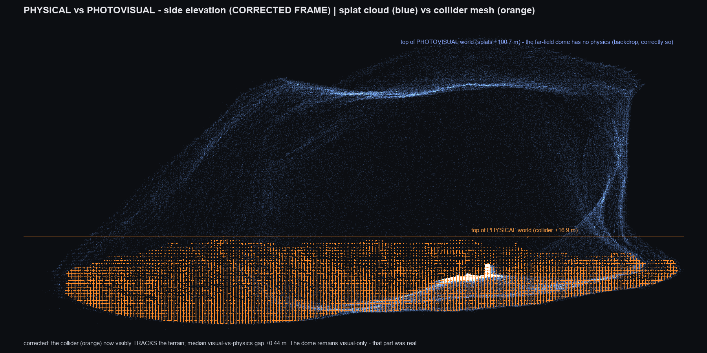

# Surveyor

Surveyor certifies the physics of AI-generated 3D Gaussian-splat worlds,
repairs what fails, and exports the result as a USD stage plus an Isaac Lab
training contract. On a 27-world benchmark with 31 planted defects it found
30 with zero false positives, and its LLM repair agent took a real generated
world from grade F to A with all 75 defect outcomes recorded and re-inspected.

## Results

| Measurement | Result | Artifact |
|---|---|---|
| Defect recall, planted-defect bench (27 synthetic worlds, 31 defects, incl. out-of-taxonomy plants) | **96.8%** (30/31); 95% lower bound 85.6% (Clopper-Pearson) | [`docs/validation/self-validation.json`](docs/validation/self-validation.json); regenerate with `npm run self-validate` |
| Defect precision, same bench | **100%** (0 false positives); 95% lower bound 90.5% | same file |
| Certificate determinism | byte-identical for the same seed, across runs and across Node vs browser (content hash matches) | [`test/certify.test.ts`](test/certify.test.ts); `npm test` |
| LLM repair agent on a real World Labs Marble world | grade **F to A**; **75/75** defect outcomes recorded (26 fixed, 17 quarantined, 32 accepted), including one patch the certifier rejected and the agent reverted | [`assets/traces/repair-episode.jsonl`](assets/traces/repair-episode.jsonl); [final certificate](assets/exports/7188e250-e2ff-43e7-babb-73834c22e932/certificate.json) |
| Cross-engine agreement, Rapier vs PhysX (Isaac Sim 5.1) | a body dropped at a certified spawn rests on the repaired floor within **1 mm** of the certificate's prediction; a scripted Franka pick-and-place sets a crate down **0.3 mm** from the probe-measured surface at lunar gravity | [`isaac/cluster/g3a.py`](isaac/cluster/g3a.py), [`g3b.py`](isaac/cluster/g3b.py); video [`assets/isaac/g3c-box-lift.mp4`](assets/isaac/g3c-box-lift.mp4) |
| Pretrained policies in the certified world, zero training | NVIDIA's lift policy delivers a crate to **2.6 cm** of goal at lunar gravity; a Unitree Go2 locomotion policy walks the repaired floor | [`assets/isaac/g4-policy-lift.mp4`](assets/isaac/g4-policy-lift.mp4), [`g7b-go2-walk-wide.mp4`](assets/isaac/g7b-go2-walk-wide.mp4) |
| Paired traversal receipt | 15 identical navmesh routes, one controller: raw world **0/15** reached, repaired world **13/15** | [`paired-receipt.json`](assets/exports/7188e250-e2ff-43e7-babb-73834c22e932/paired-receipt.json); regenerate with [`scripts/paired-receipt.ts`](scripts/paired-receipt.ts) |

Scope: the bench is synthetic indoor geometry, so the confidence bounds
describe that distribution. Outdoor worlds needed a separate calibration pass
(capture envelope, sustained-contact checks) before their grades ranked
sensibly; [HANDOFF.md](HANDOFF.md) records it. The grade predicts
navmesh-level traversability under a disclosed model class, not policy
transfer.



*What the robot sees against what it touches: splats (blue) and collider
(orange) for one generated outdoor world. Surveyor measures this divergence
per region, then grades, repairs and quarantines.*

## Pipeline at a glance

```
world.spz + collider.glb
    |
    v
survey      2,000 seeded probes, virtual LiDAR, two-way splat-vs-collider divergence, depth audit
    |
    v
certify     grade A..F; defects (holes, sills, phantom colliders, ghost geometry, scale);
            per-robot verdicts; every number carries an uncertainty range and a methods line
    |
    v
repair      LLM agent picks from 11 closed, reversible tools; the certifier re-inspects every
            action and records one outcome per defect (fixed / quarantined / accepted / escalated)
    |
    v
package     repaired collider + splats, USD stage, Isaac Lab training contract (spawns,
            quarantine masks, friction ranges), flight map, receipts, certificate content hash
```

## Why

Generated worlds ship as two files that nobody checks against each other: a
photoreal splat file (what you see) and a simplified physics shell (what a
robot touches). A floor can have a physics hole under perfect pixels; a rock
can be painted on (ghost geometry); solid collision can exist where nothing
is visible (phantom colliders). Surveyor runs physical experiments inside a
world: seeded probe rain, virtual LiDAR, two-way divergence analysis, and
produces a **certificate** (every region confirmed / observed / divergent,
every number with an uncertainty range and a methods line), a **repaired
copy**, and a **flight map** (free / occupied / *unknown* voxels + nav-graph)
that a path planner can consume directly. Verdicts are per-robot: the same
0.09 m sill fails a small rover and passes a quadruped.

Named for NASA's 1966–68 Surveyor program, which landed on the Moon to
certify the ground before Apollo risked humans on it. Built for the
**Worlds in Action** hackathon (SIGGRAPH 2026).

## Quickstart (5 minutes)

Requires Node 20+ and git. Everything except the viewer runs headless.

```bash
git clone git@github.com:YuvrajPuyam/surveyor.git
cd surveyor
npm install
cd app && npm install && cd ..   # the browser viewer has its own deps

cp .env.example .env             # fill in MARBLE_API_KEY (ask in the team channel)
npm test                         # regression suite incl. byte-identical determinism; must be green
```

First certification (no credits, no network: synthetic worlds):

```bash
npm run make:synthetic                                        # planted-defect worlds → assets/generated/
npm run certify -- assets/generated/syn-kitchen-sink --gravity mars
```

## Starting the app (browser viewer)

```bash
cd app && npm run dev
# open http://localhost:5173/?world=/marble/<world-id>
```

`assets/` is served at the dev-server root, so any bundle under
`assets/marble/<id>/` is loadable via `?world=/marble/<id>`. The saved
certificate loads automatically: grade, defect boxes, and the defect list
work without running a live survey.

**Keys** (click the 3D view once first so it has focus):

| Key | Does |
|---|---|
| `WASD` / arrows | fly (hold `Shift` to sprint) |
| `V` | collider wireframe over the splats: physics vs photovisual in one view |
| `B` | defect boxes (nearest 250; the HUD acks the toggle) |
| `J` | **jump to next defect**: teleports the camera box-to-box |
| `T` | trust map overlay (paints during/after a live survey) |
| `R` | raw run: a rover drives at a defect and physically fails |
| `P` | patrol drive · `F` re-flip splats · `I` camera mode · `G` dev mode (shows sidebar + HUD) |
| `1–5` | demo beats (`2` starts the live in-browser survey; a progress bar tracks it) |

Click any row in the certificate panel's defect list to fly to that defect.

## Using the CLI

### Certify a world

```bash
npm run certify -- <bundle-dir>                  # writes certificate.json + report.html + certificate.md
npm run certify -- <bundle-dir> --extended       # + level audit, floaters, scale consensus, settling,
                                                 #   reachability, depth consensus (informational)
npm run certify -- <bundle-dir> --evidence-tiers # outdoor policy: unwitnessed phantoms → trust map,
                                                 #   not the defect list; bucket-capped grading
# other flags: --gravity earth|moon|mars  --probes N  --seed N  --min-grade A..F  --no-report
```

Outputs: `certificate.json` (canonical, hashable), `certificate.md` (human),
`report.html` (self-contained page). Re-render from a saved certificate
without re-surveying: `npx tsx scripts/cert-md.ts <bundle-dir>`.

### The Sojourner pipeline (world → mission package)

End-to-end for a Marble **app**-exported world (app worlds are invisible to
the API: export collider `.glb` + splat `.spz` from the app's download menu
into `assets/marble/<world-id>/` as `collider.glb` + `world.spz`):

```bash
npx tsx scripts/ingest-app-bundle.ts <world-id>          # spz → visual-points.f32 + metadata.json
npm run certify -- assets/marble/<id> --extended --write-bundle
npx tsx scripts/sojourner-fix.ts assets/marble/<id>      # carve phantoms + patch holes (local floor)
                                                         #   + delete floaters → <id>-fixed/ + receipt
npx tsx scripts/sojourner-ghostfix.ts assets/marble/<id>-fixed   # build colliders for ghost rocks
                                                                 #   from splat evidence
npx tsx scripts/sojourner-grid.ts assets/marble/<id>-fixed       # flight map: free/occupied/unknown/sky
npx tsx scripts/sojourner-usd.ts  assets/marble/<id>-fixed       # Isaac-ready world.usda
npx tsx scripts/sojourner-package.ts assets/marble/<id>-fixed    # one zippable folder (see below)
```

The package (`<id>-fixed-package/`) contains `world/` (collider, splats, USD),
`certificate/`, `flightmap/` (grid + clearance field + `navgraph.json`),
`receipts/`, `proof/` images, and a README documenting every file with a C++
quickstart for the planner. **Law: source bundles are never mutated.** Every
step writes a new derivative.

Validate any package before sharing it:

```bash
npx tsx scripts/validate-certificate.ts <dir>/certificate/certificate.json
npx tsx scripts/validate-flightmap.ts   <dir>/flightmap
```

### Other everyday commands

| Command | What it does |
|---|---|
| `npm test` | full regression suite, keep it green; determinism is a product claim |
| `npm run self-validate` | certifier precision/recall vs the 27-world planted-defect bench |
| `npm run marble -- <sub>` | Marble API: `list` / `download <id>` / `generate` (**generate spends credits, ask first**) |
| `npx tsx scripts/extended-repair.ts <bundle>` | mesh hygiene + floater removal → cleaned bundle + receipt |
| `npm run repair-agent` | Claude-driven repair episode (closed 11-tool menu; bills a subscription, ask first) |
| `npm run mcp` | MCP stdio server (Claude Desktop front door) |
| `npm run wt -- add <branch>` | new git worktree under `.worktrees/`, deps installed, ready to run |

## Getting worlds

`assets/marble/` and `assets/generated/` are **gitignored** (hundreds of MB).

- **Synthetic bench**: `npm run make:synthetic` regenerates it exactly (seeded).
- **Real worlds**: ask a teammate for a bundle folder, or
  `npm run marble -- download <world-id>` (needs `MARBLE_API_KEY`; downloads
  are free). **Generating new worlds spends shared credits, always ask.**
- Marble **app** worlds can't be fetched by the API: use the app-export lane
  described in the Sojourner section.

## Architecture

```
src/core       zod schemas, PRNG, geometry, grids       : every number is a Measurement
src/ingest     GLB collider IO (applies scene transforms!), SPZ parser, Marble client, bundle format
src/physics    Rapier wrapper (deterministic fixed timestep, WASM)
src/certify    survey → metrology → defects → trust map → verdicts → certificate (+ extended profile)
src/repair     closed 11-tool repair engine (operation stack, revert, regional recertify),
               mesh hygiene, splat-derived colliders
src/export     certificate → Isaac training contract + USD stage
src/validation self-validation: planted defects vs detections, precision/recall
app/           browser viewer (Vite + three + Spark splats + Rapier & certify web workers)
mcp/           MCP stdio servers · agents/  agent prompts
scripts/       CLI: certify, marble, sojourner-* pipeline, validators, worktree helper
docs/          demo script, plan-of-record (ENDGAME.md), Q&A arsenal
test/          regression suite incl. determinism and the fail-and-adapt loop
```

## Honesty invariants (enforced in code, not prose)

- A probe fall-through counts as a hole only if an independent raycast at the
  same point also passes through; engine tunneling can't masquerade as a hole.
- The `Measurement` schema makes bare centimeter claims unrepresentable:
  value + uncertainty range + basis + methods line, always.
- Certificates are byte-identical for the same seed; never break this.
- The repair agent never edits geometry freehand: it chooses from a closed
  menu of deterministic, reversible tools, and every action is re-inspected
  by the instrument before it counts.
- Display vocabulary is **confirmed / observed / divergent**, **ghost
  geometry**, **phantom colliders**, never "lying". (Some frozen schema
  field names still use old terms; saved certificates parse against them;
  don't rename casually.)

## Where to read next

- **[HANDOFF.md](HANDOFF.md)**: deep state-of-the-project brief; read the
  vocabulary and gotchas sections before touching code.
- [docs/ENDGAME.md](docs/ENDGAME.md): the locked plan-of-record.
- `.worktrees/sojourner/sojourner/notes/error-ledger.md`: the Sojourner
  error ledger (E1–E11): every pitfall of the outdoor/drone pipeline, dated,
  with fixes.

## Secrets & spending

`.env` holds `MARBLE_API_KEY`, gitignored; never print or commit it. Marble
*generation* spends shared credits; agent repair episodes bill a Claude
subscription. **Ask before spending either.**

## Attribution

Sample worlds generated using World Labs Marble carry "Generated using World
Labs". Poly Haven panoramas are CC0. Mars panoramas: NASA/JPL-Caltech/ASU/
MSSS, converted; generated worlds are AI-derived, not NASA imagery.
